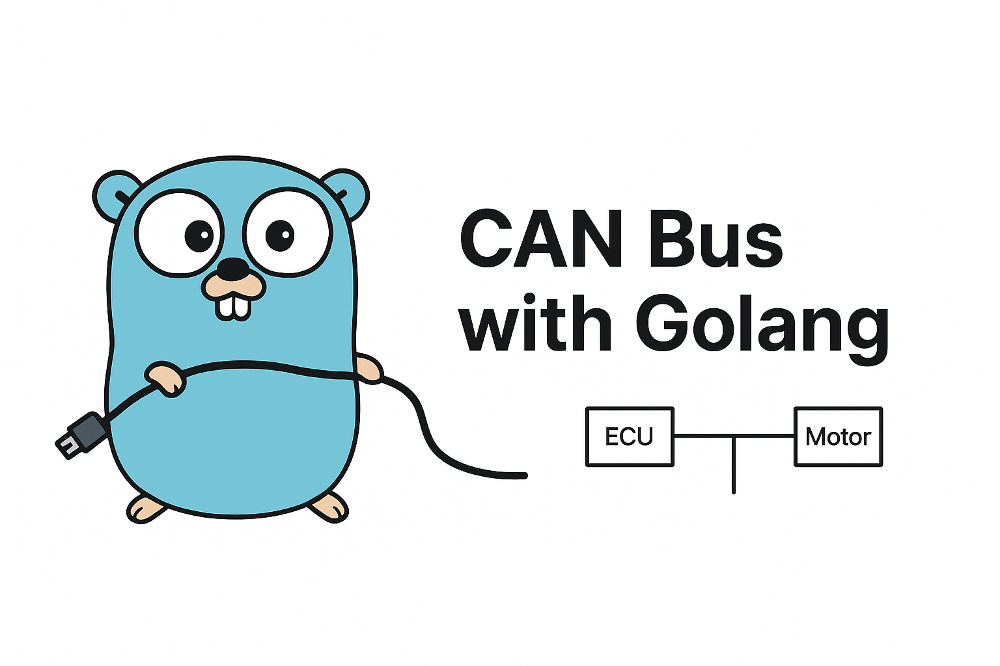

canbus
=====

[](https://pkg.go.dev/github.com/notnil/canbus)



An idiomatic, dependency-free Go library for working with Controller Area Network (CAN). The top-level module provides core CAN types and I/O, plus a small, composable `canopen` subpackage for common CANopen tasks.

- Module import: `github.com/notnil/canbus`
- CANopen helpers: `github.com/notnil/canbus/canopen`

What is CAN?
- CAN (Controller Area Network) is a robust, real-time field bus used in automotive, robotics, and industrial control.
- Frames carry up to 8 data bytes (classical CAN) with 11-bit (standard) or 29-bit (extended) identifiers.
- Broadcast medium: every node can see all frames; filtering happens at the node.

What is CANopen?
- CANopen is a higher-level protocol (CiA 301) standardized on top of CAN.
- It defines services such as NMT (network management), Heartbeat (node status), EMCY (emergency), and SDO/PDO for configuration and process data.
- This library implements practical, well-factored building blocks; it is not a full CANopen stack or object dictionary implementation.

Features
- Core `Frame` type with validation, `String()` formatting, and binary marshal/unmarshal using Linux can_frame layout (16 bytes)
- In-memory loopback bus for testing and simulation
- Optional Linux SocketCAN driver (linux-only) implemented via raw syscalls
- A lightweight `Mux` that fans-out frames to subscribers via filters
- Zero external dependencies beyond the Go standard library
- CANopen helpers:
  - COB-ID helpers and function code mapping
  - NMT build/parse utilities
  - Heartbeat (NMT error control) build/parse and subscription helper
  - EMCY encode/decode
  - SDO client supporting expedited (≤4 bytes) and segmented transfers, with typed read/write helpers

Requirements
- Go 1.22+
- Linux for SocketCAN (build tag is automatic on linux)

Install
```bash
go get github.com/notnil/canbus
```

Quick start (loopback)
```go
package main

import (
    "fmt"

    "github.com/notnil/canbus"
)

func main() {
    bus := canbus.NewLoopbackBus()
    a := bus.Open()
    b := bus.Open()
    defer a.Close()
    defer b.Close()

    go func() { _ = a.Send(canbus.MustFrame(0x123, []byte("hi"))) }()

    f, err := b.Receive()
    if err != nil { panic(err) }
    fmt.Printf("%s\n", f.String()) // e.g., 123 [2] 68 69
}
```

Frames
- `canbus.Frame` supports standard and extended identifiers, data/RTR, and length 0..8.
- Binary helpers use Linux can_frame layout and are useful for capture or transport.

```go
f := canbus.MustFrame(0x1ABCDEFF, []byte{0xDE, 0xAD})
fmt.Println(f.String()) // 1ABCDEFF [2] DE AD
b, _ := f.MarshalBinary()
var g canbus.Frame
_ = g.UnmarshalBinary(b)
```

Linux SocketCAN
- Build tag: enabled automatically on linux (`socketcan_linux.go`).
- Open a bus with an interface name (e.g., `can0`) using `canbus.DialSocketCAN("can0")`.

```go
package main

import (
    "fmt"
    "log"
    "time"

    "github.com/notnil/canbus"
)

func main() {
    bus, err := canbus.DialSocketCAN("can0")
    if err != nil { log.Fatal(err) }
    defer bus.Close()

    // Send a frame
    if err := bus.Send(canbus.MustFrame(0x123, []byte{0xDE, 0xAD, 0xBE, 0xEF})); err != nil {
        log.Fatal(err)
    }

    // Receive frames (blocks until a frame is available)
    go func() {
        for {
            f, err := bus.Receive()
            if err != nil { return }
            fmt.Println(f.String())
        }
    }()

    time.Sleep(2 * time.Second)
}
```

Mux and filters
- `Mux` owns a `Bus` for receiving, reads frames in a single goroutine, and fans out to subscribers using `FrameFilter`s without blocking each other.
- Use `canbus` filter helpers or your own `FrameFilter` functions.

```go
bus := canbus.NewLoopbackBus()
rx := bus.Open()            // for Mux receive
sender := bus.Open()        // keep original for Send
mux := canbus.NewMux(rx)

a, cancel := mux.Subscribe(canbus.ByID(0x123), 8)
defer cancel()

_ = sender.Send(canbus.MustFrame(0x123, []byte{1,2,3}))
fmt.Println((<-a).String())

mux.Close()
```

Common filters
- `canbus.ByID`, `ByIDs`, `ByRange`, `ByMask`
- `canbus.StandardOnly`, `ExtendedOnly`, `DataOnly`, `RTROnly`
- `canbus.And`, `Or`, `Not` for composition

CANopen
-------

The `canopen` subpackage provides focused helpers for NMT, heartbeat, EMCY, and SDO (expedited and segmented). It also includes a synchronous SDO client designed to work with any `canbus.Bus` and a `Mux`.

Example: Heartbeat subscribe via mux
```go
bus := canbus.NewLoopbackBus()
rx := bus.Open()
mux := canbus.NewMux(rx)

events, cancel := canopen.SubscribeHeartbeats(mux, nil, 8)
defer cancel()

// Simulate a heartbeat from node 0x05
hb := canopen.Heartbeat{Node: 0x05, State: canopen.StateOperational}
f, _ := hb.MarshalCANFrame()
_ = bus.Open().Send(f)

fmt.Printf("Heartbeat: %+v\n", <-events)
```

Example: SDO client (expedited and segmented)
```go
// Assumes a CANopen server on node 0x22 present on the bus.
bus := canbus.NewLoopbackBus() // or a real bus (e.g., SocketCAN)
tx := bus.Open()               // client transmit endpoint
rx := bus.Open()               // client receive endpoint (owned by mux)
mux := canbus.NewMux(rx)
client := canopen.NewSDOClient(tx, 0x22, mux, 0) // zero timeout waits indefinitely

// Write then read using expedited transfer (≤ 4 bytes)
_ = client.WriteU16(0x2000, 0x01, 0xBEEF)
v, err := client.ReadU16(0x2000, 0x01)
if err != nil { /* handle */ }
fmt.Printf("0x2000:01 = 0x%04X\n", v)

// Generic API
_ = client.Download(0x2001, 0x01, []byte("hello world")) // segmented if > 4 bytes
b, err := client.Upload(0x2001, 0x01)
_ = b; _ = err
```

Notes
- The SDO client requires a non-nil `Mux` and uses it to wait for responses without racing other receivers.
- Timeouts: pass a non-zero duration to `NewSDOClient` for bounded waits.
- Heartbeat and EMCY include marshal/unmarshal helpers and idiomatic types.

API reference
- `pkg.go.dev`: `https://pkg.go.dev/github.com/notnil/canbus` and `https://pkg.go.dev/github.com/notnil/canbus/canopen`

Gopher artwork
- The Go gopher was designed by Renée French. The design is licensed under the Creative Commons Attribution 3.0 License. See the [Go gopher page](https://go.dev/doc/gopher) and [CC BY 3.0](https://creativecommons.org/licenses/by/3.0/).

License
MIT
